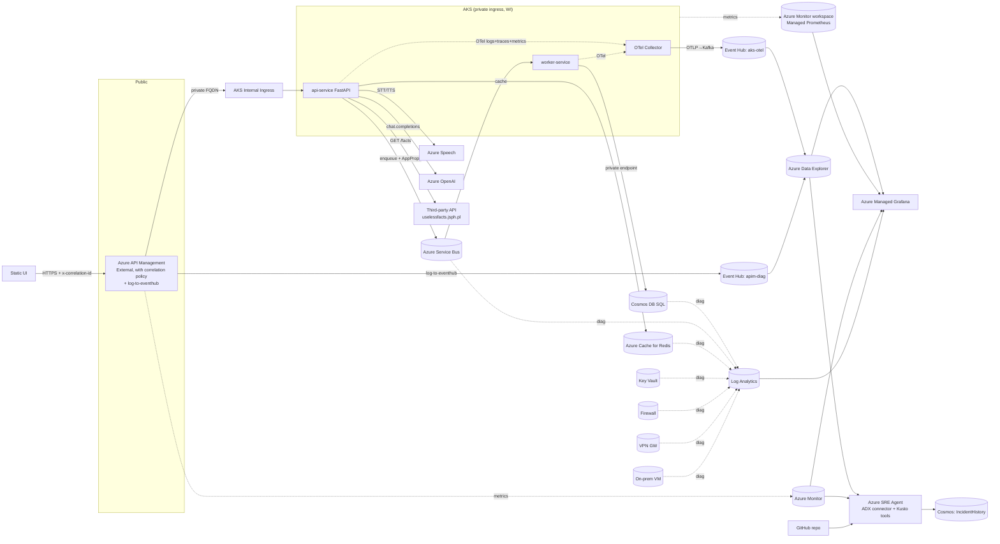

# Architecture

## High-level

## Why these choices

- **APIM External** keeps the public entrypoint while AKS stays private (internal ingress + private link via VNet integration).
- **OTel → Event Hub → ADX** is the supported, reliable path for high-cardinality app logs/spans/exceptions.  Direct ADX exporters are not first-class for OTel collector; Kafka exporter writing to Event Hub Kafka endpoint is the production pattern, with ADX **Event Hub data connection** doing JSON-line ingestion.
- **APIM diagnostics → Event Hub → ADX** gives identical query surface to the SRE Agent so it can join APIM rows with backend `AppLogs/AppExceptions/AppSpans` on `x-correlation-id` and `traceparent`.
- **Managed Prometheus** owns AKS infra metrics — keep them out of ADX.
- **Cosmos PE + Private DNS** allows scenario 3 (DNS/PE break) to be reproducible without exposing data publicly.
- **Speech + OpenAI mandatory** in business flow so scenarios 4+5 (dependency outage) become visible to SRE Agent as RCA, not as cosmetic UI errors.

## ID taxonomy & propagation

| ID | Source of truth | Propagated via |
|---|---|---|
| `correlation_id` | api-service middleware (UUIDv4 if `x-correlation-id` not provided) | Response header, OTel span attr, log field, APIM forwarded header, **SB AppProperties**, Cosmos document |
| `trace_id`/`span_id` | OTel SDK (W3C trace context) | `traceparent`/`tracestate` headers, SB AppProperties, log field |
| `request_id` | APIM `context.RequestId` (or api-service if direct) | Response header, log field, SB AppProperties |

## Failure semantics

If Speech or OpenAI is unreachable, api-service returns `503` with structured error and emits an `AppExceptions` row tagged `dependency_name=AzureOpenAI` (or `AzureSpeech`). The SRE Agent's `QueryDependencyErrors` Kusto tool fires on the spike and returns RCA with confidence > 0.8 because the failure cluster matches a single dependency.
